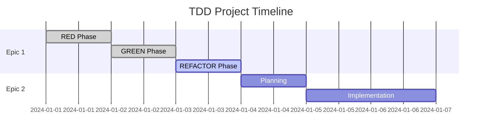

# 🎯 TDD Project Template

> **Professional Test-Driven Development** template with epic management, automated progress tracking, and TDAH-optimized workflow

[](https://github.com/davidcantidio/tdd-project-template/generate)
[](https://github.com/davidcantidio/tdd-project-template)
[](https://opensource.org/licenses/MIT)

---

## 🌟 **What Makes This Template Special?**

<div class="metrics-grid">
  <div class="metric-card red-phase">
    <h3>🧪 TDD Enforced</h3>
    <p>Red-Green-Refactor cycle built into every workflow</p>
  </div>
  
  <div class="metric-card green-phase">
    <h3>📊 Epic Management</h3>
    <p>JSON-driven project structure with GitHub integration</p>
  </div>
  
  <div class="metric-card refactor-phase">
    <h3>⏰ TDAH Optimized</h3>
    <p>Focus-optimized timer with productivity analytics</p>
  </div>
</div>

### 🚀 **Key Features**

- **🧪 TDD Methodology Enforced** - Red-Green-Refactor cycle built into every workflow
- **📊 Epic-Based Management** - JSON-driven project structure with GitHub integration
- **⏰ TDAH Time Tracking** - Focus-optimized timer with productivity analytics
- **📈 Automated Visualizations** - Real-time Gantt charts, mindmaps, and progress dashboards
- **🚀 One-Command Setup** - Interactive wizard configures everything in minutes
- **🎨 GitHub Pages Dashboard** - Beautiful, auto-updating project website
- **🔧 Performance Optimized** - Advanced caching, parallel processing, and monitoring
- **🚨 Production Ready** - Centralized error handling and graceful degradation

---

## 🚀 **Quick Start (GitHub Template)**

### **1. Use This Template**
Click the **"Use this template"** button above to create your new repository.

### **2. Clone and Initialize**
```bash
git clone https://github.com/YOUR_USERNAME/YOUR_PROJECT_NAME.git
cd YOUR_PROJECT_NAME

# Run the interactive setup wizard
python3 setup/init_tdd_project.py

# Or non-interactive mode for CI/CD
python3 setup/init_tdd_project.py --non-interactive
```

### **3. Install Dependencies**
```bash
# Using Poetry (recommended)
poetry install
poetry shell

# Or using pip
python -m venv venv
source venv/bin/activate  # Linux/macOS
pip install -r requirements.txt
```

---

## 📊 **Live Dashboard Features**

### Interactive Gantt Charts
Real-time project timeline with TDD phase tracking:



### Progress Analytics
- **Test Coverage Tracking**: Real-time coverage metrics
- **TDD Phase Distribution**: Visual breakdown of Red-Green-Refactor cycles
- **Time Accuracy**: Estimated vs actual completion times
- **Productivity Insights**: TDAH-optimized focus sessions

---

## 🧪 **TDD Workflow Example**

### 1. 🔴 RED Phase - Write Failing Tests
```python
# tests/test_todo.py
def test_create_todo_item():
    todo = TodoItem("Learn TDD")
    assert todo.title == "Learn TDD"
    assert todo.completed == False
```

### 2. 🟢 GREEN Phase - Make Tests Pass  
```python
# src/todo.py
class TodoItem:
    def __init__(self, title):
        self.title = title
        self.completed = False
```

### 3. 🔄 REFACTOR Phase - Improve Design
```python
# src/todo.py (refactored)
from dataclasses import dataclass
from typing import Optional

@dataclass
class TodoItem:
    title: str
    completed: bool = False
    created_at: Optional[datetime] = None
```

---

## 📋 **Epic Management System**

### Epic Structure
Each epic is defined in JSON format with complete TDD workflow:

```json
{
  "epic": {
    "id": "EPIC-1",
    "name": "User Authentication",
    "tdd_enabled": true,
    "tasks": [
      {
        "id": "EPIC-1.1",
        "title": "TEST: User login validation",
        "tdd_phase": "red",
        "estimate_minutes": 30
      },
      {
        "id": "EPIC-1.2", 
        "title": "IMPL: Login functionality",
        "tdd_phase": "green",
        "dependencies": ["EPIC-1.1"]
      }
    ]
  }
}
```

### GitHub Integration
- **🔗 Issue Linking**: Automatic links between epics and GitHub issues
- **📈 Progress Tracking**: Real-time updates on epic completion
- **🏷️ Label Management**: Automatic TDD phase labels
- **📊 Project Boards**: Kanban-style workflow management

---

## ⏰ **TDAH Time Tracking**

### Focus-Optimized Features
- **Pomodoro Integration**: Built-in focus timers
- **Progress Persistence**: SQLite-backed session tracking  
- **Analytics Dashboard**: Productivity pattern analysis
- **Distraction Management**: Smart notification controls

### Usage Example
```bash
# Start focused work session
python tdah_tools/task_timer.py start EPIC-1.1

# View productivity analytics
python tdah_tools/analytics_engine.py metrics --days 7

# Generate focus dashboard
python tdah_tools/analytics_engine.py dashboard --output dashboard.html
```

---

## 📈 **Automated Visualizations**

### Gantt Charts
Professional project timelines with:
- TDD phase color coding
- Weekend exclusions
- Milestone markers
- Dependency arrows
- Real-time progress updates

### Mindmaps
Hierarchical epic structure visualization showing:
- Epic relationships
- Task dependencies
- Completion status
- Time estimates

### Progress Dashboards
Interactive analytics with:
- Plotly-powered charts
- Test coverage trends
- Productivity metrics
- TDD cycle analysis

---

## 🛠️ **Development Tools**

### Quality Assurance
- **Pre-commit hooks**: Automated code quality checks
- **Test coverage**: Minimum 90% coverage enforcement
- **Type checking**: MyPy integration
- **Code formatting**: Black + Flake8

### CI/CD Integration
- **GitHub Actions**: Automated testing and deployment
- **Docker support**: Containerized development environment
- **Multi-language**: Python, Node.js, and more

---

## 📚 **Documentation & Support**

- 📖 **[Setup Guide](./setup.html)** - Detailed installation instructions
- 🎯 **[Features](./features.html)** - Complete feature overview  
- 💡 **[Examples](./examples.html)** - Real-world usage examples
- 🔧 **[Customization Guide](https://github.com/davidcantidio/tdd-project-template/blob/main/docs/CUSTOMIZATION_GUIDE.md)** - Template customization
- 🐛 **[Troubleshooting](https://github.com/davidcantidio/tdd-project-template/blob/main/TROUBLESHOOTING.md)** - Common issues and solutions

---

## 🤝 **Getting Started**

Ready to transform your development workflow? 

<p align="center">
  <a href="https://github.com/davidcantidio/tdd-project-template/generate" style="text-decoration: none;">
    
  </a>
</p>

### Next Steps:
1. **Click "Use this template"** to create your repository
2. **Clone and run setup**: `python3 setup/init_tdd_project.py`  
3. **Create your first epic**: Follow the TDD workflow
4. **Watch the magic happen**: Automated dashboards and progress tracking

---

## 📞 **Contact & Support**

- **Author:** [David Cantidio](https://github.com/davidcantidio)
- **Template Issues:** [Report Here](https://github.com/davidcantidio/tdd-project-template/issues)
- **Feature Requests:** [Discussions](https://github.com/davidcantidio/tdd-project-template/discussions)

---

<div class="footer-note">
  <p><strong>Built with the TDD Project Template</strong> 🚀</p>
  <p>Transform your development workflow with professional TDD practices</p>
</div>

<style>
.metrics-grid {
  display: grid;
  grid-template-columns: repeat(auto-fit, minmax(250px, 1fr));
  gap: 20px;
  margin: 30px 0;
}

.metric-card {
  padding: 20px;
  border-radius: 12px;
  text-align: center;
  box-shadow: 0 4px 6px rgba(0,0,0,0.1);
  transition: transform 0.2s;
}

.metric-card:hover {
  transform: translateY(-2px);
}

.metric-card.red-phase { 
  background: linear-gradient(135deg, #ffebee 0%, #ffcdd2 100%);
  border-left: 4px solid #f44336;
}

.metric-card.green-phase { 
  background: linear-gradient(135deg, #e8f5e8 0%, #c8e6c9 100%);
  border-left: 4px solid #4caf50;
}

.metric-card.refactor-phase { 
  background: linear-gradient(135deg, #e3f2fd 0%, #bbdefb 100%);
  border-left: 4px solid #2196f3;
}

.metric-card h3 {
  margin-top: 0;
  color: #333;
}

.footer-note {
  background: #f8f9fa;
  border: 1px solid #e9ecef;
  border-radius: 8px;
  padding: 20px;
  text-align: center;
  margin-top: 40px;
}

.footer-note p {
  margin: 5px 0;
  color: #6c757d;
}
</style>